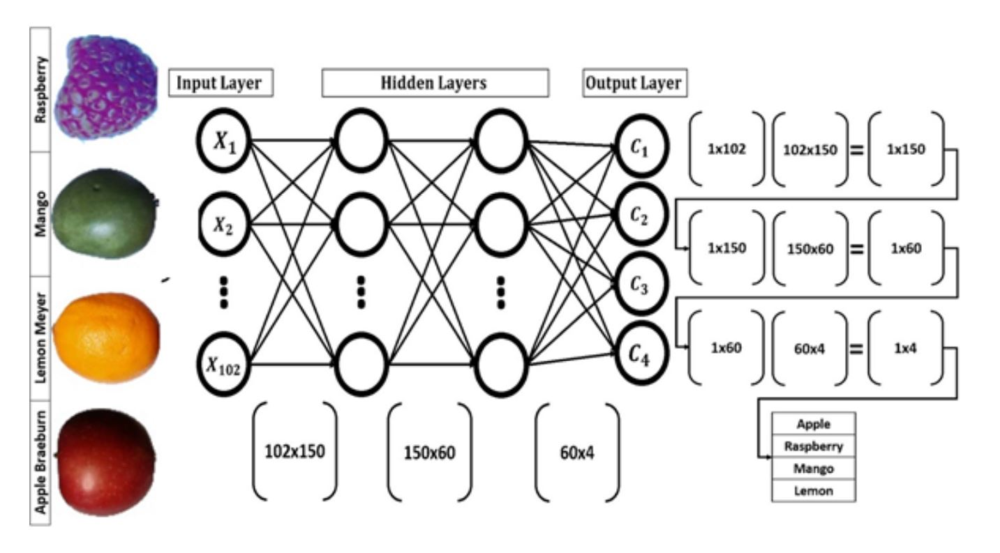

# Fruit-360-classification
In this project, a fully connected Artificial Neural Network(ANN) is implemented from scratch.

## Neural network architecture and details
This ANN was implemented to classify 4 classes of fruits. Feedforward algorithm was implemented in vectorized form using softmax as activation function for each layer. Back propagation was implemented in both *iterative* and *vectorized* forms with *sum of squared errors (SSE)* as cost function. *Stochastic Gradient Descent* algorithm was used to train the network.

### Additional parts included:
- Hyperparameter tuning 
- Improving SGD using momentum algorithm in this [file](./ANN_Project/ANN_momentum.py)
- Adding more classes of fruits and hyperparameter tuning in [More Fruits](./MoreFruit/)
- Using softmax as output layer's activation function in this [file](./ANN_Project/ANN_Extra4.py)
## Dataset
* The [Kaggle 360-Fruits dataset](https://www.kaggle.com/moltean/fruits) was used.